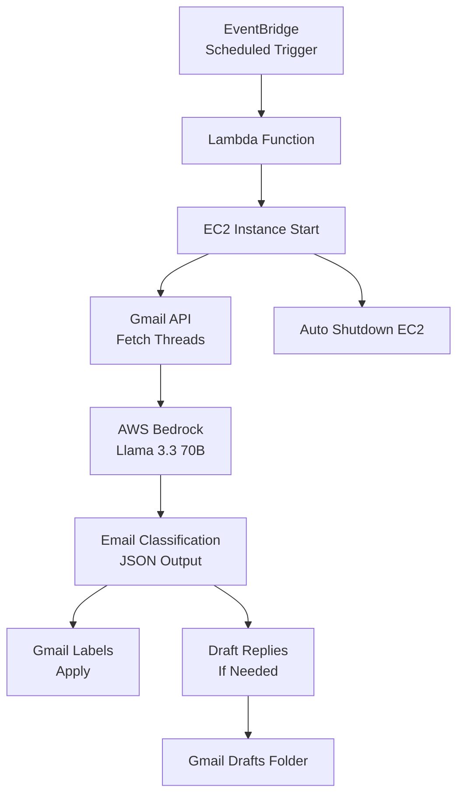

# Gmail AI Organizer

**An Autonomous, Cloud-Native Email Intelligence System**

## Overview

In modern professional workflows, email overload is not a volume problem but a **prioritisation problem**. Critical emails are often buried among newsletters, notifications, and low-priority updates, leading to delayed responses and reduced productivity.

**Gmail AI Organizer** is a fully automated, cloud-native system that intelligently processes Gmail inboxes using large language models (LLMs) to:

- Understand email context and intent
- Classify emails by urgency and importance
- Automatically apply Gmail labels
- Draft context-aware replies for time-sensitive emails
- Run completely hands-free on a schedule
- Optimise cost via automatic EC2 lifecycle management

The system is designed with **enterprise-grade safety, idempotency, and cost efficiency** in mind.

---

## Key Features

- Context-aware email classification using **AWS Bedrock (Llama 3.3 70B)**  
- Thread-level analysis (not single-message heuristics)  
- Deterministic JSON outputs with defensive parsing  
- Automatic Gmail labelling (Urgent, Important, Promotional, Low Priority)  
- Adaptive draft replies (never auto-sent)  
- Fully automated execution using **EventBridge + Lambda + EC2**  
- Zero idle cost via self-terminating EC2 instances  
- Safe, review-first workflow (human always in control)

---

## System Architecture

### High-Level Flow

```
EventBridge (Schedule)
        ↓
Lambda (Start EC2)
        ↓
EC2 Instance
        ├─ Fetch Gmail Threads
        ├─ Classify with Bedrock
        ├─ Apply Gmail Labels
        ├─ Create Draft Replies
        └─ Auto-Shutdown EC2
```

### Detailed Architecture Diagram (Mermaid)



---

## Classification Schema

Each email thread is classified into exactly one category:

```json
{
  "category": "urgent | important | promotional | skip",
  "urgency_reason": "string",
  "needs_reply": true,
  "suggested_action": "string"
}
```

### Design Principles

- Strict schema enforcement
- Single-object output (never arrays)
- Deterministic decoding (temperature = 0)
- Defensive parsing to prevent pipeline failure

---

## Gmail Label Strategy

Labels are created once and reused:

| Category    | Label Name        |
|-------------|-------------------|
| Urgent      | AI/Urgent         |
| Important   | AI/Important      |
| Promotional | AI/Promotional    |
| Skip        | AI/LowPriority    |

Label colouring is intentionally left to Gmail UI to avoid undocumented API restrictions.

---

## Draft Reply System

- Drafts are created only if `needs_reply = true`
- Tone and length are adaptive based on context
- Drafts are **never auto-sent**
- One draft per thread (idempotent)
- User always reviews before sending

---

## Automation & Cost Optimisation

### Why EC2 instead of Lambda? 

- Gmail OAuth requires persisted credentials
- Bedrock inference exceeds Lambda time limits
- Avoids cold-start instability

### Cost Strategy

- EC2 runs **only** during execution
- EC2 self-terminates after pipeline completion
- Lambda + EventBridge remain idle and low-cost
- **Result:  near-zero idle cost**

---

## Tech Stack

### Core

- Python 3.12
- AWS Bedrock (Llama 3.3 70B)
- Gmail API

### AWS Infrastructure

- Amazon EC2
- AWS Lambda
- Amazon EventBridge
- IAM (least-privilege)

### Libraries

- `boto3`
- `google-api-python-client`
- `google-auth`
- `google-auth-oauthlib`
- `python-dotenv`

---

## Repository Structure

```
Gmail-AI-Classifier/
├── app/
│   ├── gmail/
│   │   ├── auth.py
│   │   ├── fetch.py
│   │   ├── labels. py
│   │   └── drafts.py
│   ├── llm/
│   │   └── bedrock.py
│   └── processing/
│       ├── classify.py
│       ├── label_threads.py
│       └── draft_threads.py
├── lambda/
│   └── start_ec2.py
├── run_pipeline.py
├── requirements.txt
└── README. md
```

---

## Safety & Reliability Considerations

- No auto-sending of emails
- Strict output validation
- Idempotent operations
- Separation of concerns (AI ≠ orchestration)
- Defensive handling of LLM edge cases
- OAuth secrets never committed

---
